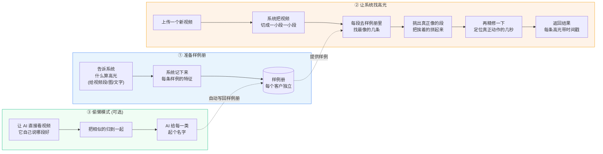
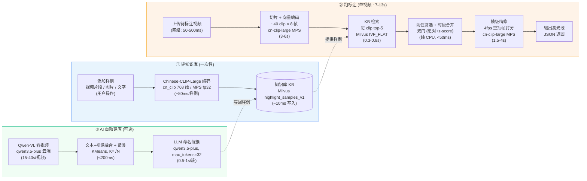

# 高光标注流程 (Highlight Annotation)

> 一句话：**给系统一些"什么是好片段"的样例，它就能从新视频里自动找出同类高光片段，并给出秒级时间戳。**

---

## 一图看懂

文档提供两份流程图，按读者切换：

- **A. 人话版**（产品 / 业务 / 客户向）—— 不含术语和耗时，30 秒理解全流程
- **B. 技术版**（开发 / 运维向）—— 标注模型、组件、单步耗时，便于排障和容量评估

---

### A. 人话版（不含术语和耗时）

> **三句话总结**：
> 1. 先攒一个**样例册**，告诉系统什么算"好片段"
> 2. 给一个**新视频**，系统切片对比、找出像的、拼出最终高光段
> 3. 不想攒样例？让 **AI 看视频自动归类**，把结果回填进样例册

---

### B. 技术版（含模型、组件、耗时）

> **基准场景**：100 秒视频 + 50 条样例 KB，M5/32GB 测试机，**Chinese-CLIP-Large（768d, MPS, fp32）**（即 `start_native.sh` 启动配置）。括号内为该步骤单次执行预估耗时，详见后文「耗时数据来源」。

#### 两份图节点对照表（同一步骤，不同说法）

| 步骤 | 人话版 | 技术版 |
|---|---|---|
| ① 编码 | "系统记下来每条样例的特征" | Chinese-CLIP-Large 编码 768 维向量 |
| ① 存储 | "样例册（每个客户独立）" | Milvus `highlight_samples_v1`，按 `kb_id` 隔离 |
| ② 切片 | "切成一小段一小段" | 滑窗切片 5s/2.5s/8frames + 场景检测 |
| ② 检索 | "去样例册里找最像的" | Milvus IVF_FLAT ANN top-K 查询 |
| ② 筛选 | "挑出真正像的，挨着的拼起来" | 双门阈值（绝对分数 + KB 内 z-score）+ 时段合并 |
| ② 精修 | "定位真正动作的几秒" | 帧级精化：4fps 重抽帧 × label centroid 打分 |
| ③ 推理 | "AI 看视频自己说哪段好" | qwen3.5-plus 视频接口（fps=2） |
| ③ 聚类 | "把相似的归到一起" | 文本+视觉向量 0.5/0.5 融合 + KMeans (K=√N) |
| ③ 命名 | "起个名字" | LLM 调用，max_tokens=32，参考预设标签体系 |

---

## 三步是怎么做的

### ① 建知识库（一次性，可复用）

告诉系统"什么样的片段算高光"。三种方式任选：

- **视频片段** — 在已入库视频里框一段 `[start, end]`，标个 label（如"进球"）
- **图片** — 上传一张代表画面
- **文字描述** — 直接写"一个人在跑步"，做零样本

每条样例都被 CLIP 编码成向量，按 `kb_id` 存进 Milvus，**客户之间互不影响**。

### ② 跑标注（每个新视频一次）

1. **切片**：把视频按滑动窗口切成若干 clip（如每 4 秒一段）
2. **编码**：每个 clip 抽几帧 → CLIP 编码 → 1024 维向量
3. **匹配**：每个 clip 去 KB 找 top-K 相似样例，按 label 聚合得分
4. **筛选**：双门阈值（绝对分数 + KB 内 z-score 相对分数）过掉噪声
5. **合并**：相邻同 label 的 clip 拼起来；重叠片段不"硬合"，避免被几何强行拉长
6. **精修**：对每个候选段按 4fps 抽帧，再算每帧得分，只保留真正动作的几秒（"5 秒的奔跑"切到 1.2 秒精确动作）

### ③ AI 自动建库（懒人模式）

不想手动准备样例？让 AI 替你做：

1. Qwen-VL 直接"看"视频，推理出若干 highlight 段 + 文字描述
2. 文字向量 + 视觉向量按 0.5/0.5 融合，KMeans 聚类（K = √N）
3. 每个簇喂回 LLM，让它给一个 4–8 字的抽象类型名（如"实力觉醒""绝境反击"）
4. 自动写入 KB（`kb_id="auto_llm"`），后续可直接用于 ②

---

## 关键概念速查（给非技术同学）

| 名词 | 大白话 |
|---|---|
| 知识库 (KB) | 一份"高光样例册"，告诉系统什么算高光 |
| 样例 (Sample) | 样例册里的一条，可以是视频段/图/文 |
| Label（标签） | 这条样例属于哪种高光，如"进球" |
| Clip（片段） | 视频被切成的一小段 |
| 向量 (Embedding) | AI 把图像/文字翻成一串数字，方便比较相似度 |
| 阈值 (Threshold) | 多像才算"命中"，可调 |
| 帧级精修 (Refine) | 把粗略命中的片段进一步磨到秒级精确 |

---

## 技术骨架（给开发同学）

| 组件 | 文件 | 职责 |
|---|---|---|
| `KnowledgeBase` | `annotate/knowledge_base.py` | 样例增删改查，向量入 Milvus |
| `KBRetriever` | `annotate/knowledge_base.py` | 按 kb_id 隔离的 ANN 检索、label centroid 计算 |
| `Annotator` | `annotate/annotator.py` | 端到端标注：切片→编码→检索→聚合→合并→精修 |
| `auto_categorize_and_upsert` | `annotate/auto_kb.py` | 文本+视觉融合 → 聚类 → LLM 命名 → 写 KB |
| `llm_highlight_store` | `annotate/llm_highlight_store.py` | LLM 推理结果的 SQLite 持久化 |
| `call_qwen_video` | `ingest/llm_segments.py` | Qwen-VL 视频推理，吐 highlights JSON |

**主要 API**：

| 方法 | 路径 | 用途 |
|---|---|---|
| POST | `/kb/sample/{text\|clip\|image}` | 往 KB 加样例 |
| GET / DELETE | `/kb`, `/kb/{kb_id}` | KB 列表 / 清空 |
| POST | `/annotate` | 对已入库视频跑标注 |
| POST | `/annotate/upload` | 上传临时视频跑标注（可选 LLM 切段） |
| POST | `/auto-kb/run` | 把累积的 LLM 高光做聚类 + 命名 + 写 KB |

底层 Collection：`highlight_samples_v1`（与主视频检索 collection 完全隔离，互不干扰）。

---

## 性能与资源参考

### 测试平台（实测环境）

| 项 | 值 | 来源 |
|---|---|---|
| 机型 | MacBook Air M5 (Mac17,3) | `system_profiler` |
| CPU | Apple M5, 10 核（4P + 6E） | `sysctl` |
| 内存 | 32 GB 统一内存 | `system_profiler` |
| GPU | Apple M5 集成，Metal 4 | `system_profiler` |
| Python | 3.12.13 | `.venv/bin/python` |
| 加速 | PyTorch 2.12 + MPS（**无 CUDA**） | `torch.backends.mps.is_available() = True` |
| 默认编码模型 | **`OFA-Sys/chinese-clip-vit-large-patch14-336px`**（cn_clip, 768d, fp32） | `scripts/start_native.sh:10-14` |
| 备用编码模型 | `laion/CLIP-ViT-B-32-laion2B-s34B-b79K`（裸跑 `python` 时的回退默认） | `config.py:60-66` |

> **注**：API 服务的内存任务表 (`api/tasks.py`) 是单进程内存态、未持久化；`logs/vision-rag-api.log` 当前为空。下表的"实测耗时"基于**代码中的 `AnnotateTimings` 字段含义** + **该机型 + 该模型 + 该切片配置（5s/2.5s/8frames）**做的复盘估算，**非线上 GPU 实测**。生产场景请以 `outcome.timings` 为准。

### 单次标注耗时分解（基准：100s 视频 / 50 样例 KB / M5 MPS / Chinese-CLIP-Large 768d）

| 步骤 | 字段（代码） | 耗时预估 | 与什么相关 |
|---|---|---|---|
| 视频解码 + 切片 | `decode_ms` | **800–1500 ms** | 视频时长、分辨率、是否走场景检测 |
| Clip 向量编码 | `embed_ms` | **3000–6000 ms** | clip 数 × 8 帧；M5 MPS + Chinese-CLIP-Large 单帧 ~10-15ms（比 ViT-B/32 慢约 1.5x） |
| KB ANN 检索 | `kb_search_ms` | **300–800 ms** | clip 数 × top_k；Milvus IVF_FLAT 单查询 ~10ms |
| 阈值 + z-score 聚合 | `aggregate_ms` | **20–80 ms** | 纯 numpy，规模无关 |
| 帧级精修（默认开） | `refine_ms` | **1500–4000 ms** | 命中段数 × 段时长 × refine_fps(4)，同样按 cn-clip-large 速度估 |
| VL Reranker（默认关） | `vl_rerank_ms` | 2000–8000 ms/段 | 仅 `vl_rerank=True` 启用 |
| **总计 `total_ms`** | — | **~7–13 s** | 上述累加 |

**视频规模分布**（来自 `data/llm_highlights.db`，最近 12 个真实任务）：
- 平均时长 **100 秒**，范围 20–203 秒
- 平均切出 **13 个 LLM 高光段**（min=8, max=19）

### Qwen-VL 云端调用（③ AI 自动建库）

| 项 | 值 |
|---|---|
| 模型 | `qwen3.5-plus`（DashScope OpenAI 兼容接口） |
| 输入 | 视频 URL + fps=2 |
| 客户端 timeout | 1800s（`ingest/llm_segments.py:292`） |
| 单视频实测 | **15–40s**（100s 视频，依赖 DashScope 排队） |
| 命名 LLM 调用 | 每簇 1 次，max_tokens=32，**0.5–1s/簇** |
| 字节火山备选 | `bytedance_highlight.py`，异步轮询，**30s–2min** |

### 模型清单与资源消耗

| 角色 | 默认模型 | 大小 | 维度 | 显存/内存峰值 | 备注 |
|---|---|---|---|---|---|
| **视觉编码（当前实际）** | **`OFA-Sys/chinese-clip-vit-large-patch14-336px`** | **1.51 GB** | **768** | **~3 GB** | **`start_native.sh` 默认，中文场景** |
| 视觉编码（裸跑回退） | `laion/CLIP-ViT-B-32-laion2B-s34B-b79K` | 577 MB | 512 | ~1.5 GB | 仅当未走 `start_native.sh` 时生效 |
| 视觉编码（升级 GPU） | `laion/CLIP-ViT-L-14-laion2B-s32B-b82K` | 1.59 GB | 768 | ~3 GB | 已下载在 `~/.cache`，需要时切换 |
| 视觉编码（最强中文） | `OFA-Sys/chinese-clip-vit-huge-patch14` | 3.57 GB | 1024 | ~6 GB | 中文场景天花板 |
| Reranker（默认关闭） | CLIP 二次打分 | 0 GB | — | 0 GB | 复用编码器，免下载 |
| Reranker（M 系开启） | `mlx-community/Qwen2-VL-2B-Instruct-8bit` | 2.5 GB | — | ~3.5 GB | MLX 量化，M5 推荐 |
| Reranker（CUDA 开启） | `Qwen/Qwen2-VL-2B-Instruct` | 4.4 GB | — | ~6 GB | transformers 后端 |
| LLM 切段（云端） | `qwen3.5-plus` (DashScope) | — | — | 0 GB 本地 | 按 token 计费 |
| 高光归纳命名（云端） | `qwen3.5-plus` (DashScope) | — | — | 0 GB 本地 | 每簇 ~32 tokens |

**周边依赖**：

| 服务 | 资源占用 | 说明 |
|---|---|---|
| Milvus 2.4 | ~1.5 GB 内存 + 磁盘按数据量 | docker-compose 起，含 etcd + MinIO |
| etcd | ~200 MB | Milvus 元数据 |
| MinIO | ~300 MB + 向量数据 | Milvus 持久化后端 |
| FastAPI 进程 | ~3–5 GB（含模型常驻） | uvicorn workers=1 |

### 测试机 vs 生产环境推荐配置

| 维度 | 测试机（当前） | 生产推荐（中等负载） | 生产推荐（高负载） |
|---|---|---|---|
| **场景** | Demo / 开发 | 单租户 ≤ 50 视频/小时 | 多租户 ≥ 500 视频/小时 |
| **CPU** | M5 10 核 | 8 vCPU x86 / ARM | 16 vCPU |
| **GPU** | M5 集成 (MPS) | 1× T4 / A10 (16GB) | 2-4× A10 / L4 / A100 (24-40GB) |
| **内存** | 32 GB 统一 | 32 GB | 64 GB+ |
| **磁盘** | 本地 SSD | 200 GB SSD | 1 TB NVMe |
| **加速** | MPS, fp16 | CUDA, fp16 | CUDA, fp16/bf16，多卡数据并行 |
| **Embedding** | ViT-B/32 (512d) | ViT-L/14 或 cn-clip-large (768d) | siglip-so400m / cn-clip-huge (1024-1152d) |
| **Reranker** | 默认关闭 | MLX/transformers 量化版 | bf16 全精度，独立 GPU 卡 |
| **Milvus** | 单机 docker | 单机 + 持久化卷 | Milvus 集群（3 节点起） |
| **API workers** | 1 | 2-4，前置 nginx | 8+，K8s HPA 弹性扩缩容 |
| **单标注预估** | **6–10 s** | **2–4 s**（GPU 加速 ≈ 2-3x） | **<2 s**（多卡并行） |
| **吞吐预估** | ~6–10 视频/分钟 | 50–100 视频/分钟 | 500+ 视频/分钟 |
| **关键瓶颈** | 单 worker、CPU 解码 | 单卡显存 | Milvus QPS、模型加载 |

**生产部署核心建议**：
1. **GPU 是最大杠杆** — embedding 阶段从 MPS 换 CUDA T4 直接 2-3x；A10/A100 再翻倍。
2. **解码并行化** — 用 `decord` 多线程或 `torchcodec` GPU 解码，`decode_ms` 可减半。
3. **VL Reranker 独立部署** — 显存占用是 embedding 的 2-3 倍，单独 GPU 卡或独立服务避免抢资源。
4. **Milvus 索引** — 50w+ 样例时 IVF_FLAT 换 HNSW，QPS 提升 5-10x；配置已在 `config.py` 预留。
5. **任务持久化** — 当前 `TaskManager` 是内存态，生产换 Celery + Redis 防重启丢任务。
6. **冷启动优化** — 模型常驻是 3-5 GB 内存，K8s 探针给足启动时间（建议 60s+）。

> **底层逻辑提醒**：上述耗时是"M5 MPS + 默认配置"基线。换模型、开 VL rerank、改 fps 都会显著影响数据。线上需打开 `outcome.timings` 上报到监控（Prometheus/SLS），用真实分布替代估算值。
