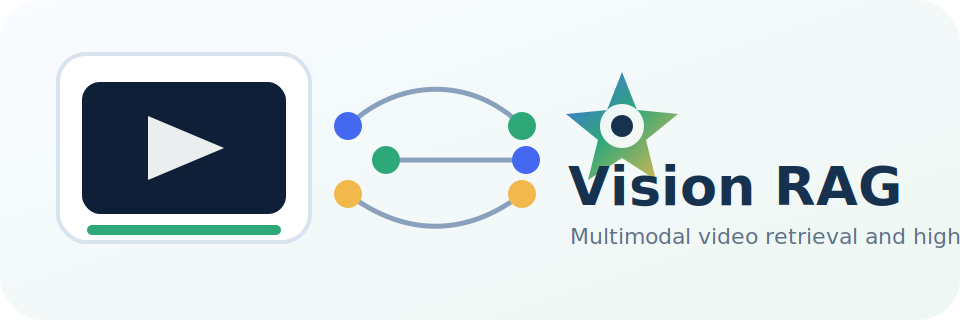

# Vision RAG



Vision RAG is a local-first video retrieval and highlight annotation system. It indexes video clips into Qdrant named vectors, searches them with multimodal signals, and uses local Qwen2-VL to understand, rerank, and reject weak highlight candidates.

The project is designed for short drama, animation, and AI-generated comic videos where a useful result needs both visual similarity and plot-level reasoning.

## What It Does

- **Video ingest**: decode videos into clips, sample frames, generate thumbnails, run CLIP embeddings, optional ASR, and optional Qwen2-VL clip understanding.
- **Video search**: search with text or image queries against Qdrant named vectors and merge neighboring hits into playable results.
- **Highlight annotation**: retrieve highlight examples from a Qdrant knowledge base, aggregate multimodal scores, merge adjacent clips, then let local Qwen2-VL confirm or reject candidates.
- **Auto highlight library**: rebuild `highlight_example_v1` from Qdrant `highlight_clips`, cluster highlight candidates, name clusters, and store examples as visual/caption/transcript named vectors.
- **Review loop**: show accepted and rejected candidates separately, collect feedback, and keep annotation tasks restorable by task id.

## Architecture

```text
video file
  -> VideoProcessor clips and thumbnails
  -> Chinese CLIP visual vectors
  -> optional faster-whisper transcript
  -> optional Qwen2-VL caption/reason/tags
  -> Qdrant collection: highlight_clips

query or annotation clip
  -> visual/caption/transcript query vectors
  -> Qdrant multimodal retrieval
  -> weighted score aggregation
  -> adjacent clip merge
  -> local Qwen2-VL rerank / reject
  -> web result page
```

## Qdrant Collections

`highlight_clips`

Primary video clip index. Each point stores clip metadata plus named vectors:

- `highlight_visual_*`
- `highlight_caption_*`
- `highlight_transcript_*`

`highlight_example_v1`

Highlight knowledge base generated from the clip index. It uses the same named-vector scheme so annotation recall can compare current clips against examples across visual, caption, and transcript modalities.

## Tech Stack

| Layer | Main Components |
| --- | --- |
| API | FastAPI, Uvicorn |
| UI | Single-page HTML/CSS/JS app in `web/index.html` |
| Vector DB | Qdrant named vectors |
| Embeddings | Chinese CLIP / OpenCLIP |
| Local VLM | Qwen2-VL via MLX |
| ASR | faster-whisper |
| Video | decord, OpenCV, PyAV fallback |
| Background tasks | in-process task manager |
| Local stores | SQLite for feedback and LLM highlight records |

## Project Layout

```text
vision-rag/
├── api/                 # FastAPI routes and async task orchestration
├── annotate/            # highlight KB, annotation, Qwen2-VL understanding, auto KB
├── assets/              # repository assets such as the SVG logo
├── docker/              # helper service Dockerfiles
├── docs/                # focused technical notes
├── ingest/              # video decode, embedding, ASR/VLM enrichment, Qdrant writes
├── scripts/             # local maintenance and replay scripts
├── search/              # Qdrant retriever, search pipeline, rerankers
├── web/                 # browser UI
├── config.py            # environment-driven configuration
├── docker-compose.yml   # Qdrant, SQLite UI, API
└── requirements.txt
```

Runtime directories such as `data/`, `models/`, `logs/`, `.venv/`, `.env`, and local tool state are intentionally ignored.

## Quick Start

1. Create an environment file.

```bash
cp .env.example .env
```

2. Fill in provider keys only if you need cloud-assisted features such as DashScope or TOS upload. Local Qdrant search and the web app can run without committing secrets.

3. Start services.

```bash
docker compose up -d qdrant sqlite-ui api
```

4. Open the app.

```text
http://localhost:28765/web/
```

5. Optional native run on Apple Silicon.

```bash
python -m venv .venv
. .venv/bin/activate
pip install -r requirements.txt
python -m api.server
```

## Common Workflows

### Ingest Videos

Use the web UI `+ 视频入库` drawer or scripts under `scripts/` to ingest local videos. Ingested clips are stored in Qdrant with visual vectors and optional caption/transcript vectors.

### Search

The search page supports text and image queries. Text search combines visual, caption, and transcript vector lanes. Image search focuses on visual similarity.

### Annotate Highlights

Use the `运行标注` page with a knowledge base id such as `auto_llm`. When local Qwen2-VL reranking is enabled, confirmed highlights and rejected candidates are shown separately.

### Rebuild the Highlight Library

The auto-KB endpoint scans `highlight_clips`, optionally refines candidates with Qwen2-VL, clusters them, names clusters, and writes `highlight_example_v1`.

```bash
curl -X POST http://localhost:28765/auto-kb/run \
  -H 'Content-Type: application/json' \
  -d '{"kb_id":"auto_llm","force_full":true,"candidate_mode":"balanced","vlm_refine":true}'
```

## Configuration

Most settings are read from environment variables in `.env`.

Important groups:

- `QDRANT_*`: Qdrant connection, collection, vector naming, recall weights.
- `EMBEDDING_*`: embedding backend/model/device/dimension.
- `RERANKER_*`: local Qwen2-VL backend and model.
- `ENABLE_LOCAL_ASR` and `LOCAL_ASR_*`: faster-whisper transcript settings.
- `DASHSCOPE_*`, `TOS_*`, `BYTEDANCE_MEDIAKIT_TOKEN`: optional cloud integrations.

Never commit `.env`. Use `.env.example` as the shareable template.

## Security Notes

- Secrets and runtime data are ignored by both `.gitignore` and `.dockerignore`.
- Qdrant data, uploaded videos, thumbnails, transcripts, SQLite DBs, logs, and model caches are local artifacts.
- Before publishing, run a secret scan across tracked files and verify `git status --ignored`.

## Current Status

The active implementation is Qdrant-first. Milvus-era docs and code paths have been retired from the main workflow. The UI, API, ingest pipeline, video search, highlight annotation, and auto-KB rebuild all use Qdrant collections.
